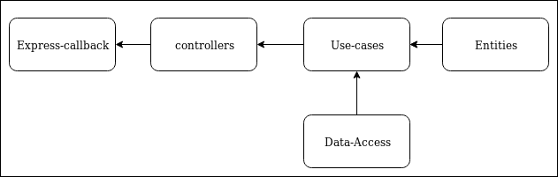

# Server Architecture

## This server is An implementation of the SOLID principles

## Philosophy:
- Seperatation of consern 
- Dependency injection
- Loose coupeling
- Easy Debugging 

## Entities: (The Real Architecture an logic of the App)
#### Describe The app and the assets it uses. if the entities Change, Everything change.
- This is where we are going to define our entities and Make them. 
- Entities Hold the logic and useful functions that defines the app. 
- We can stop the errors of a mal-formatted entity in this early stage

## Data-Access
#### Describe the layer of persistance.
- This is the part that is responsible for making direct contact with the database. 
- It is the only part that knows about the type of our database 
- It exposed necessary Actions to other parts (a-k-a: The Usecases)

## Use-cases
#### Describe the Actions that are allowed to be made. Looking at the Folder of the use cases should give you a general Idea of What your app is capable of doing. 
- It is a module that will give you an idea of what you can do just by looking at the files that it containes
- It abstracts the DataAccess actions and make use of our entities. 
- It is the right place to moderate the entities and use their Actions. 

## Controllers
#### A use-case will need some data and parametres to work with. This is where controllers are handy. They describe the Way your usecases get their parametres. 
- Each controller is a representation and a Usage of a Usecase
- Controllers are where we moderate the HttpRequests that we make.

## Express-callback
#### Abstraction over the HTTP Requests. Uses the controllers To make different types of requests.
- This is where comes our Server, (which in this case is the Express server)
- It uses the controllers and connect each one with a route

